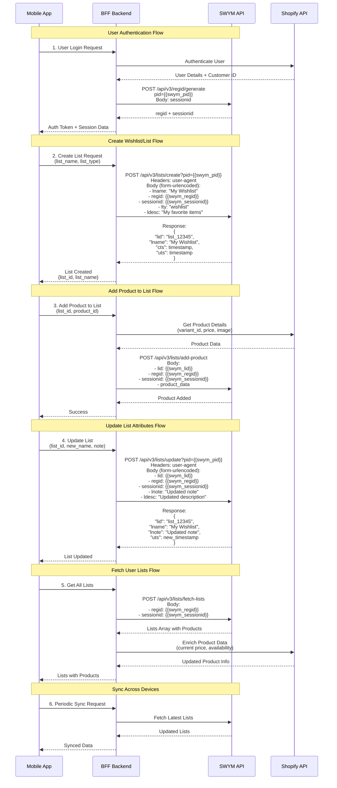

# SWYM Integration Sequence Diagram

## Mobile App with BFF Backend Integration

This diagram shows how a mobile app integrates with SWYM Lists API through a Backend-for-Frontend (BFF) layer.

## API Integration Details

### Required Environment Variables

| Variable | Description | Example Value |
|----------|-------------|---------------|
| `swym_api_endpoint` | SWYM API base URL | `https://swym-dev.swymrelay.com` |
| `swym_pid` | Store identifier from SWYM Admin | `your-store-pid` |
| `swym_regid` | Shopper unique identifier | Generated via `/api/v3/regid/generate` |
| `swym_sessionid` | Session token | Generated via `/api/v3/regid/generate` |
| `swym_lid` | List ID | Returned from create/fetch operations |
| `user_agent` | App identifier | `ArdeneApp/1.0 (iOS; Mobile)` |

### Key Integration Points

#### 1. Authentication & Registration
- **BFF Backend** handles user authentication with Shopify
- Generate SWYM `regid` and `sessionid` using `/api/v3/regid/generate`
- Store these credentials securely in the user session
- Pass to mobile app for subsequent requests

#### 2. List Management
- **Create List**: Use `POST /api/v3/lists/create` with required form data
- **Update List**: Use `POST /api/v3/lists/update` to modify attributes
- Store returned `lid` (list ID) in app state or backend database

#### 3. Product Integration
- BFF acts as orchestrator between SWYM and Shopify
- Fetch product details from Shopify before/after SWYM operations
- Enrich SWYM list items with real-time Shopify data (price, availability)

#### 4. Data Synchronization
- SWYM maintains the source of truth for lists
- BFF caches frequently accessed lists
- Mobile app syncs on app launch and periodically

### BFF Backend Responsibilities

1. **Authentication Orchestration**
   - Manage Shopify user authentication
   - Generate and store SWYM credentials per user
   - Maintain session state

2. **Data Enrichment**
   - Fetch product details from Shopify
   - Combine SWYM list data with Shopify product data
   - Return unified response to mobile app

3. **Error Handling**
   - Handle SWYM API rate limits (429 errors)
   - Retry logic for failed requests
   - Graceful degradation if SWYM is unavailable

4. **Security**
   - Never expose SWYM credentials to mobile app directly
   - Validate all mobile app requests
   - Implement request throttling

### Content-Type Notes

- SWYM APIs use `application/x-www-form-urlencoded` for request bodies
- BFF can accept JSON from mobile app and transform to form data
- Responses from SWYM are in JSON format

### Error Handling

Common SWYM error codes:
- `400`: Bad Request - Invalid parameters
- `401`: Unauthorized - Invalid credentials
- `403`: Forbidden - Access denied
- `404`: Not Found - Resource doesn't exist
- `429`: Rate Limited - Too many requests
- `500/503`: Server Error - SWYM service issues

BFF should handle these gracefully and return appropriate mobile-friendly responses.
